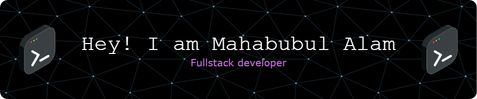

# 👋 Hi, I'm MD. Mahabubul Alam  ### 💻 MERN Stack & WordPress Expert | Full Stack Developer  I'm a passionate Full Stack Web Developer with a strong grip on the **MERN stack (MongoDB, Express, React, Node.js)** and over **4 years of experience working with WordPress**, especially building and customizing websites using **Elementor** and other advanced theme builders.  ## 🚀 What I Do  - 🔧 Build scalable full-stack applications with the MERN stack   - 🌐 Create custom, high-performance WordPress websites   - 🎨 Design and develop Elementor-powered WordPress themes and widgets   - ⚙️ Customize plugins, themes, and WooCommerce for client-specific needs   - 📦 Integrate third-party APIs and backend systems   - 🧠 Solve problems with clean, maintainable code  ## 🛠️ Tech Stack  - **Frontend:** React, HTML, CSS, JavaScript, Tailwind CSS, Bootstrap   - **Backend:** Node.js, Express.js, MongoDB, Firebase   - **CMS:** WordPress, Elementor Pro, WooCommerce   - **Other Tools:** Git, GitHub, Vercel, Netlify, cPanel, Figma, REST API  ## 📈 Experience Highlights  - 👨‍💻 4+ years of WordPress development experience   - ⚡ Built 50+ custom Elementor-based WordPress sites   - 🌍 Developed full-stack applications with dynamic dashboards & user authentication   - 🧩 Created reusable components and custom widgets for Elementor    

## 🌐 Socials:
    

# 💻 Tech Stack:
                       
# 📊 GitHub Stats:
 
 

## 🏆 GitHub Trophies

---

<!-- Proudly created with GPRM ( https://gprm.itsvg.in ) -->
